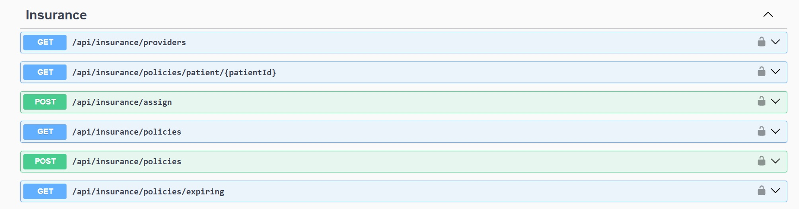
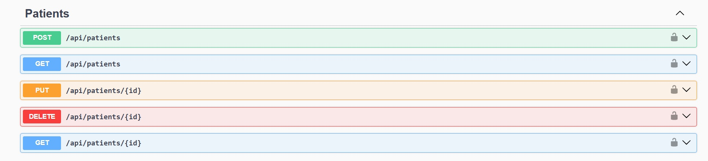
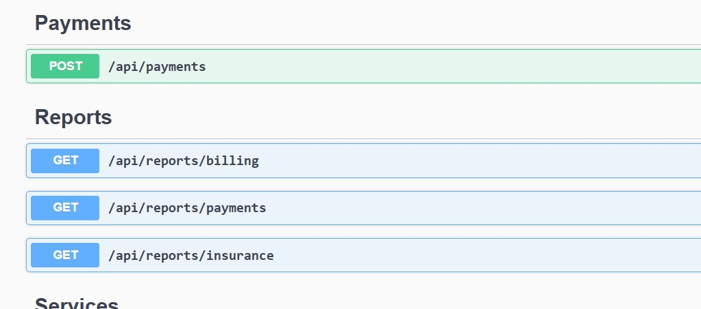

# 🏥 MediCare – API Documentation

All API screenshots are stored inside the **Project_Images** folder.

---

## 🔐 Authentication API

**POST /api/auth/login**  
Authenticates users and returns JWT token.

---

## 🧾 Billing APIs

Handles bill creation, invoice generation, and email invoices.

---

## 🛡 Insurance APIs

Manages insurance providers, policies, and patient assignments.

---

## 🧑‍⚕️ Patient APIs

CRUD operations for patients.

---

## 💳 Payments & Reports APIs

Payment processing and analytics reports.

---

## 🛠 Services & Users APIs

Service master and user management APIs.

---

© 2026 MediCare – Billing & Insurance System
